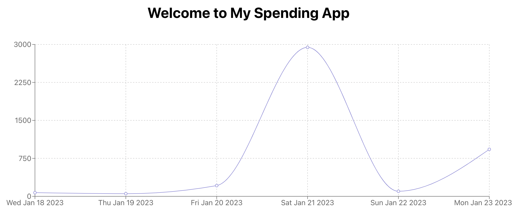

# MySpendingApp

**MySpendingApp** is a lightweight personal finance tracker built with **Java 17** and **Spring Boot**.\
The goal is to create a clear and maintainable backend while showcasing modern Java 17 features in a practical way.

---

## MVP · v0.1

- **Record transactions**  
  Add, edit, and delete expenses or income entries with date, amount, category, and optional note.

- **Transaction list with filters**  
  Chronological table with sorting, pagination, and quick filters by date range and category.

- **Monthly summary**  
  Totals for expenses, income, and balance—compact overview of where the money goes.

- **Minimal categories + CRUD**  
  Seed set (Food, Transport, Leisure, etc.) with endpoints to add or rename categories.

- **Lightweight persistence**  
  SQLite for development, H2 for tests; schema auto-generated at backend startup.

- **REST API v1**  
  `/transactions` and `/categories` endpoints (GET, POST, PUT, DELETE) returning clean JSON.

- **React frontend (SPA)**  
  Single page with “Add transaction” form, transaction table, and summary section.

- **Smoke tests & CI**  
  Minimal seed data plus a couple of API smoke tests running in GitHub Actions.


---


## 🚀 Development Roadmap

| Phase | Purpose | Status |
|-------|---------|--------|
| Phase 0 – Setup | Skeleton, CI, Docker, health-check | ✅ Done |
| Phase 1 – Data Model | Finalise production-ready schema (users, categories, transactions, import batches) on SQLite/H2; seed demo data | ✍️ In progress |
| Phase 2 – MVP (Spending CRUD) | Implement login + JWT and full spending CRUD on top of the mature DB | ⬜ Planned |
| Phase 3 – Modernisation | Replace legacy constructs with Java 17+ features; introduce records, sealed classes | ⬜ Planned |
| Phase 4 – Enhancements | FX API integration, dashboards, reporting, test-data tools | ⬜ Planned |


### ✅ Phase 0 — Setup (Completed!)
*Goal: bring the project to life locally with CI, health-check, logging, and a working Docker stack.*

- [x] **P0.1**  Spring Boot skeleton + Gradle build
- [x] **P0.2**  `/actuator/health` endpoint exposed and healthy
- [x] **P0.3**  GitHub Actions workflow (build + tests badge)
- [x] **P0.4**  Dockerised stack: backend (JDK 17 + SQLite) & frontend (React + Nginx) via `docker compose`
- [x] **P0.5**  Fix persistent logging: logs now land in `/app/logs`


### ✍️ Phase 1 — Data Model (Working on it!)
*Goal: lock down a production-ready schema<—>users, categories, transactions and preload demo data so later phases can 
focus on business logic and UI.*

- [x] **P1.1**  Add README with schema diagram + [DB-evolution](docs/DB-evolution.md) log
- [x] **P1.2**  User entity & repository
- [x] **P1.3**  Category entity (per-user)
- [x] **P1.4** Setup dev/test environments, added H2 in-memory DB, test profile & Gradle/Docker test config
- [X] **P1.5** Extend Transaction with `user_id`, `category_id`, `note`
- [x] **P1.6** Mark `conversion` as deprecated (retained for frontend chart; removed/refined in Phase 4)
- [ ] **P1.7** Update `schema.sql` & `data.sql` with UUIDs + seed demo user & categories
- [ ] **P1.8** H2 integration tests for User & Transaction repos


### ⬜ Phase 2 — MVP (Spending CRUD) !!Needs clarification!!
**Goal:** deliver core CRUD + summary endpoints using Java 17 records and Streams.

| Item | Detail |
|------|--------|
| **Entity** | `Spending` (`id`, `amount`, `currency`, `category`, `type`, `date`) |
| **Endpoints** | `POST /api/v1/spendings` · `GET /api/v1/spendings` · `GET /api/v1/spendings/summary` |
| **Persistence** | SQLite (prod dev) / H2 (tests) |
| **Key Java 17** | Records (`SpendingRequest`, `SpendingResponse`) · `Stream.toList()` · `var` · Jakarta Validation |


- [ ] Bootstrap project
- [ ] Spending entity
- [ ] Record DTOs
- [ ] Repository (`JpaRepository<Spending, Long>`)
- [ ] Service (`create`, `findAll`, `summary`)
- [ ] REST controller + MockMvc tests
- [ ] Validation on DTOs
- [ ] SQLite config (`ddl-auto=update`)
- [ ] Integration tests (happy path)
- P2.1 – Quick filters & sorting (LocalDate + Streams)


### 🕓 Phase 3 — Modernization (planned) !!Needs clarification!!

- Switch expressions & pattern matching in business logic
- Sealed hierarchy for `SpendingType` (`INCOME` / `EXPENSE`)
- Replace remaining POJOs with records where safe
- Modular package refactor & clearer domain boundaries


### 🕓 Phase 4 — Enhancements (planned) !!Needs clarification!!
- [ ] **P1.6** Update Conversion model to UUID PKs
- Currency-rate integration & automatic conversion
- [ ] **P1.5**  ImportBatch entity & FK from Transaction
- CSV import / export, advanced reports, minimal dashboard
- Random test-data generators (`RandomGeneratorFactory`)
- Observability (metrics, tracing) and deployment hardening

---

## Language & Tools

- [JDK17](https://jdk.java.net/archive/)
- [Gradle](https://gradle.org/) - as a package manager
- [Spring Boot](https://spring.io/projects/spring-boot) - as a server-side framework
- [React](https://reactjs.org/) - client-side framework

---

## Quickstart

This section contains all the information required for getting the app up and running. The application contains the following two directories:

- [server/](server/) - the backend (Java 17 + Spring Boot)
- [client/](client/) - the frontend (React)

You can run the stack with Docker (recommended) or run server/client locally in separate terminals.

---

### Docker (recommended)

To run the stack with Docker, follow these steps:

1. From the repo root, build and start the services:

```bash
  docker compose up --build -d
```

2. Check the backend:
  - Health: [http://localhost:8080/actuator/health](http://localhost:8080/actuator/health)
  - Logs (persisted): `./logs/mySpendingApp.log`
  - SQLite DB (persisted): `./data/mySpendingApp.db`

3. Open the frontend: [http://localhost:3000](http://localhost:3000)

4. Stop everything:

```bash
  docker compose down
```

---

### Server (local)

To run the server locally (without Docker), follow these steps:

1. Navigate to the server directory (`cd server`)

2. Install/build dependencies:
  - Unix/macOS: `./gradlew build`
  - Windows: `.\gradlew build`

3. Start the server (Tomcat on port 8080):
  - Unix/macOS: `./gradlew bootRun`
  - Windows: `.\gradlew bootRun`

---

### Client (local)

- System requirements
  - NodeJS v18

To run the client locally, follow these steps:

1. Navigate to the client directory (`cd client`)

2. Install dependencies:

```bash
  npm install
```

You can ignore the severity vulnerabilities, this is a [known issue](https://github.com/facebook/create-react-app/issues/11174) related to `create-react-app` and not actual vulnerabilities for this setup.

3. Start the client:

```bash
  npm start
```

---

## Formatting Client

To format your code using [prettier](https://prettier.io/), follow these steps:

1. Navigate to the client directory (`cd client`)

2. Run this command:

```bash
  npm run lint
```

To ensure you are using the correct version of prettier, make sure to format your code after installing the dependencies (`npm install`).

---

## Database and Seed Data

**Note: No manual database setup is required to get started.**

- **Dev (Docker/local)**: the backend uses SQLite, persisted to `./data/mySpendingApp.db` (volume-mounted in Docker). Logs are written to `./logs/mySpendingApp.log`. Data persists across restarts.
- **Seed data**: if the database file is new/empty, Spring may execute `data.sql` on startup to insert demo data. If the DB already exists, existing data is kept and the seed won't reapply.
- **Tests**: run on H2 in-memory via a dedicated `application-test.properties` and do not touch the SQLite file.

Seed files live under `server/src/main/resources/`.

---

## Verify That Everything Is Set Up Correctly

To verify that the frontend is working properly, go to [http://localhost:3000](http://localhost:3000). You should see the homepage titled "Welcome to MySpendingApp" and a chart as below.



---

