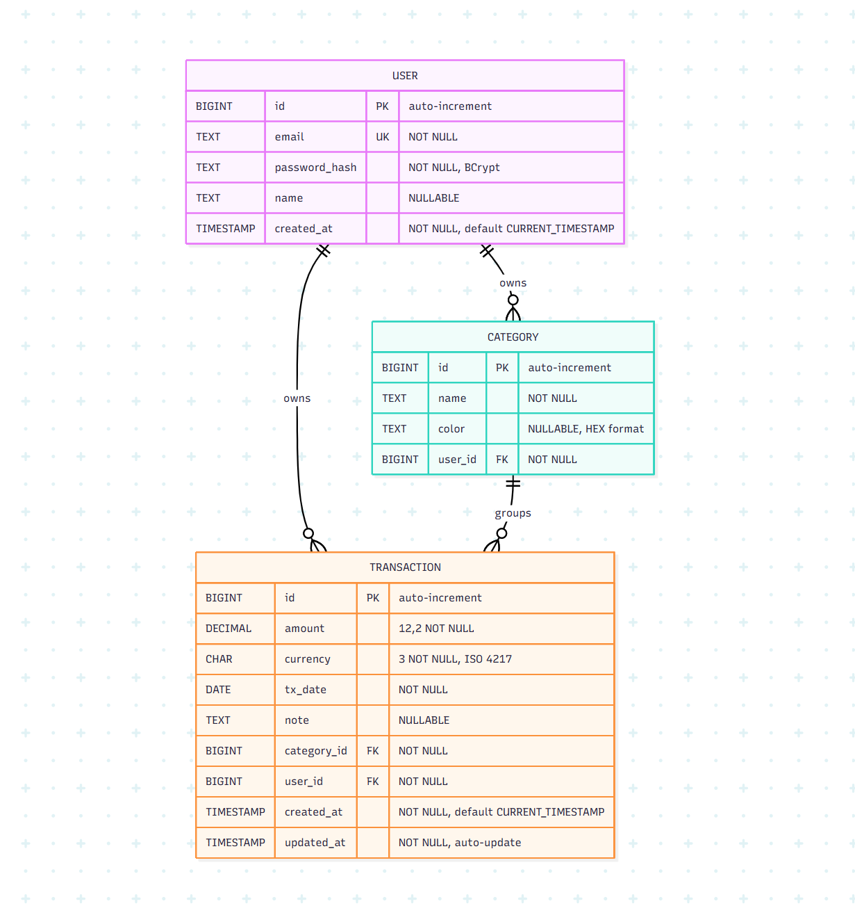

# Database Schema Evolution

This doc will grow as the project does.  
Every time we tweak or extend the schema, the change goes here, phase by phase.  
Right now the big milestone is the Phase 2 MVP: getting the core tables finished and live.

---

## 0️⃣ Initial Baseline (end of Phase 0)

| Table        | Columns                                              | Notes                    |
|--------------|------------------------------------------------------|--------------------------|
| `transactions` | `id PK`, `amount`, `currency`, `tx_date`, `created_at`, `updated_at` | Single-table prototype stored in SQLite/H2. No ownership or categorisation yet. |

---

## 1️⃣ Phase 1 Additions

| Tag | Change | Purpose |
|-----|--------|---------|
| **P1.2** | `users` — `id`, `email`, `password_hash`, `name`, `created_at` | Required for login + JWT. |
| **P1.3** | `categories` — `id`, `name`, `color`, `user_id FK` | Per-user category taxonomy. |
| **P1.4** | Extend `transactions` with `user_id FK`, `category_id FK`, `note` | Link every row to an owner & category; support free-text notes. |
| **P1.5** | `spring.jpa.hibernate.ddl-auto=update` (dev & test) | Auto-sync entities to SQLite/H2 while schema is in flux. |
| **P1.6** | Seed script: demo user + four default categories | App is clickable right after `docker compose up`. |
| **P1.7** | H2 repo tests (User, Transaction) | Protect relationships and constraints in CI. |

> _CSV import batches were deferred to Phase 4 to keep the MVP lean._

---

## 2️⃣ Schema for the MVP (end of Phase 2)

### Conventions

* **Primary keys** – `UUID` stored as `CHAR(36)` (uppercase v4).  
  Rationale: readable in logs, cross-DB compatible, avoids numeric enumeration.

* **Foreign keys** – also `CHAR(36)` UUID, `NOT NULL` unless explicitly optional.

* **Created / Updated timestamps** – `TIMESTAMP` with default `CURRENT_TIMESTAMP`; updated via trigger or Hibernate annotation.

Any future change (e.g. switch to ULID or binary UUID) must be documented here and back-migrated.
